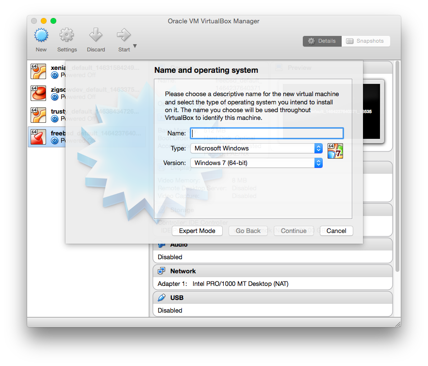
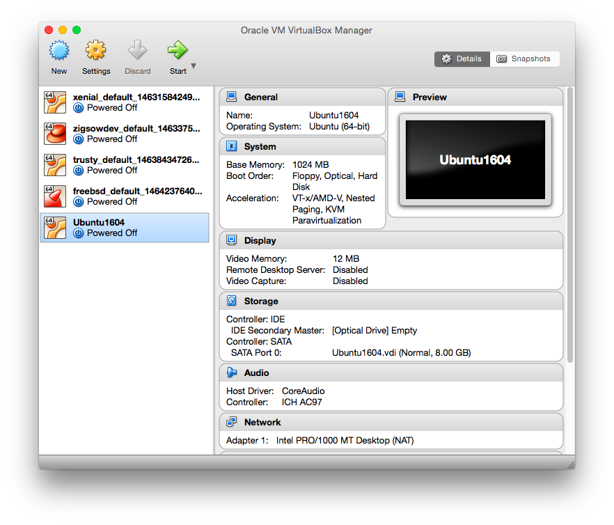
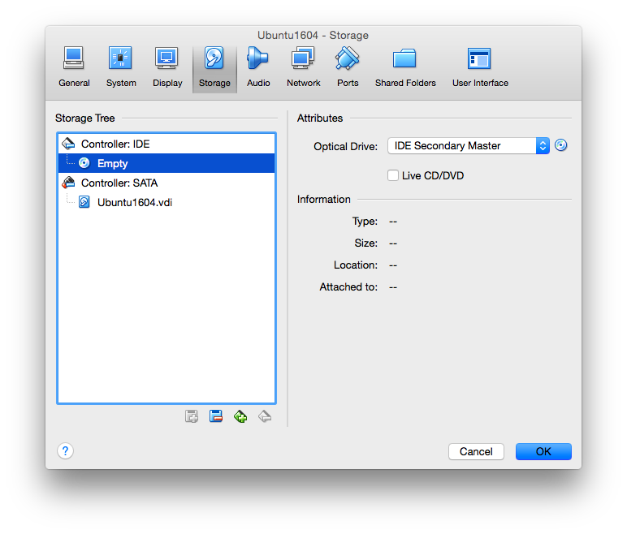
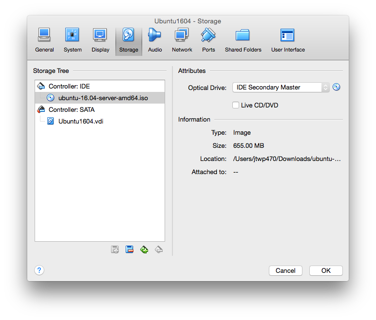

# 第1章: 仮想マシンにOSをインストールする

仮想マシンにOSをインストールします.これは手順書なのでこの通りやってもらえばインストールできるはずです.例に出てくるホストマシンのOSはMacですがその他のOSでも問題ないはずです.

> #### ホストマシンとゲストマシン
> ホストマシンとは計算機に入っているそのものを指す表現です.例えばあなたがMacBookを使っているとき,電源スイッチを入れると通常OSXが立ち上がります.そのような状態でのマシンを仮想マシン(ゲストマシン)と比較してホストマシンと呼びます.
> ゲストマシンとはホストマシン上の仮想マシンのことを指します.更にゲストマシン上にゲストマシンを構築した場合はゲストマシンのゲストマシンと呼ぶのが正しいかもしれませんね.

## 1-1 仮想マシンとOSのイメージをダウンロードする

まず仮想マシンを作成するため, ソフトウェアをインストールします.今回はVirtualBoxを利用することにします.適当に最新版をダウンロードしてきてください.

次にゲストマシンのOSをダウンロードします.
サーバー用Linuxディストリビューションとして以下のものが有名です.

* Ubuntu 
* CentOS (RedHat Enterprise Linux)
* Arch Linux
* FreeBSD

各ディストリビューションの違いなどは以下に記しておきますので興味があれば読んでみてください.

### Ubuntu
UbuntuはCanonicalに資金提供を受けているLinuxディストリビューション.
Debianからの派生ディストリビューションであり, デスクトップ, サーバー利用どちらにも多い.

Ubuntuのバージョニングとして12.04, 15.10といったバージョンが有る.サーバー用にはLTSとつくものを利用すると良い.LTSはLong term supportの略で簡単にいえば長い間サポートをしてくれるということである.UbuntuのLTSのサポートは5年, 何もついていないものは2年であるのでサーバーには持って来い.実際我が家のOSはすべて14.04 LTSがインストールされている.最新版は16.04 LTSなので今回はこれを利用する.

### CentOS
CentOSは後述するRHEL(RedHat Enterprise Linux)互換のディストリビューション.企業内のサーバーなどでよく使われるし学内でも使われている.またAWSにデフォルトで搭載されるAmazon Linuxなどもこれをベースにしている.
個人的にはCentOSはUbuntuのLTSに比べパッケージの更新速度が遅いと思っているがRHELのサポートをそのまま受けることもできるし, 利用者も多い, 企業内で利用されている, AWSでも使っているなど多くの利点もあるので知っていて損はない.

最新はCentOS 7でLinuxカーネルのバージョンは3.10 (Ubuntu 16.04は4.1x系なのでなんとも言えない)

#### RedHat Enterprise Linux
RedHat社が手掛けるディストリビューション. 有償サポートが付いている.

### Arch Linux
みんな大好きArch Linux. いち早く最新のパッケージを入手できる(ような気がする).個人的にはデスクトップとして利用するのは楽しいがサーバーとして使うにはちょっとつらい.
最初に入っているパッケージが非常に少なく, 自分好みにカスタマイズできるという利点が大きい.
またOSのインストールにはコマンドを打つ必要があり, 簡単ではないため, OSのインストールが裏でどうやっているのか? などを知りたいときにも勉強になる.

私自身これを使っていた時もあったがカスタマイズとインストールのめんどくささから結局Ubuntuに逃げたw

### FreeBSD

さて, 上記の理由よりUbuntuを採用する.以下で最新版のUbuntu 16.04 LTS Server版のisoファイルをダウンロードしてください.

* http://ftp.jaist.ac.jp/pub/Linux/ubuntu-releases/16.04/

### 1-2 仮想マシンにインストールする
まずVirtualBoxを起動してNewというボタンを押します.すると以下のようになります.

ここで `Type: Linux`, `Version: Ubuntu (64bit)` を選択して次に進みます.

次はメモリの量を指定します.勿論メモリが大きい方がよいですがホストマシンのメモリを専有してしまうため,ホストマシンのメモリが4GB程度であれば1GB程度までを, 8GBくらいあるのなら2GBくらいにしてもよいでしょう.今回は1024MB(1GB)にしました.

次は仮想HDDの領域を設定します.これはデフォルトの8GBで問題ないのでそのまま進めてください.
順調にうまくいき最後に[Create]を押すと仮想マシンが生成され以下のようにトップ画面に戻ります.

ここまできたら次はUbuntuのISOディスクを設定します.
[Settings] -> [Storage]に行き Controller: IDE の下にEmptyがあることを確認します.

右側にあるOptional Driveの更に右にあるディスクマークをクリックし, ISOファイルを選択します.

こんな感じに. そしたらOKを押してTOP画面に戻り実際にサーバーを起動してみましょう.

起動すると以下の様な感じになります.

マウスなどが仮想マシンに取られてしまい, ホストマシンに戻したいときは今回の場合, 右下に書いてあるとおり**左Command**キーを押すことで戻ることができます.

まずはじめにシステムの言語を設定します.個人的にはエラーメッセージなどが日本語で表示されるとあとあと困るという経験から(文字化けしてメッセージが読めないなど)英語にすることを勧めます.

1. Install Ubuntu Server
2. Language: English
3. Country: other -> Asia -> Japan
4. Default locale setting: United States (en_US.UTF-8)
5. Detect Keyboard: no -> Japanese -> Japanese
6. Hostname: 適当に決める
7. Username: 適当に決める
8. Password: 適当に決める
9. Encrypt your home directory?: no
10. Timezone: Asia/Tokyo なら OK それ以外はやり直し
11. LVM: Guided - use entire disk and setup LVM
12. Write the changes to disks and configure LVM?: Yes
13. HTTP Proxy: 設定する必要ないので何も入力せずContinue
14. 

