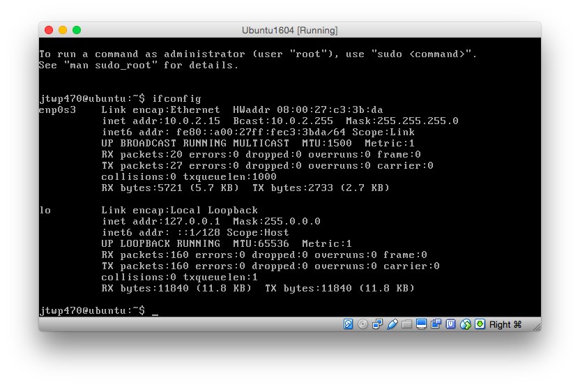
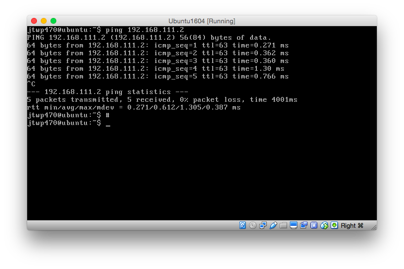
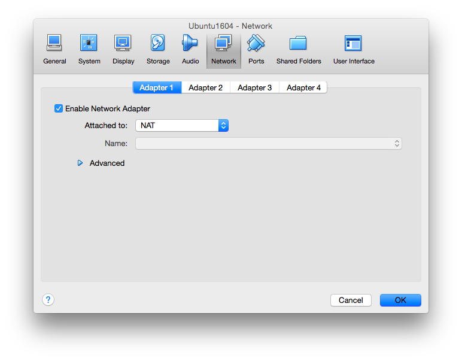
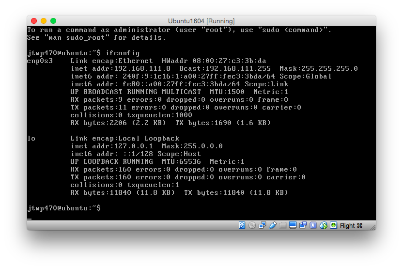
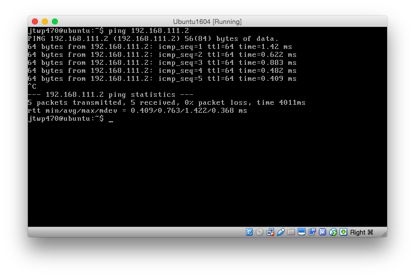
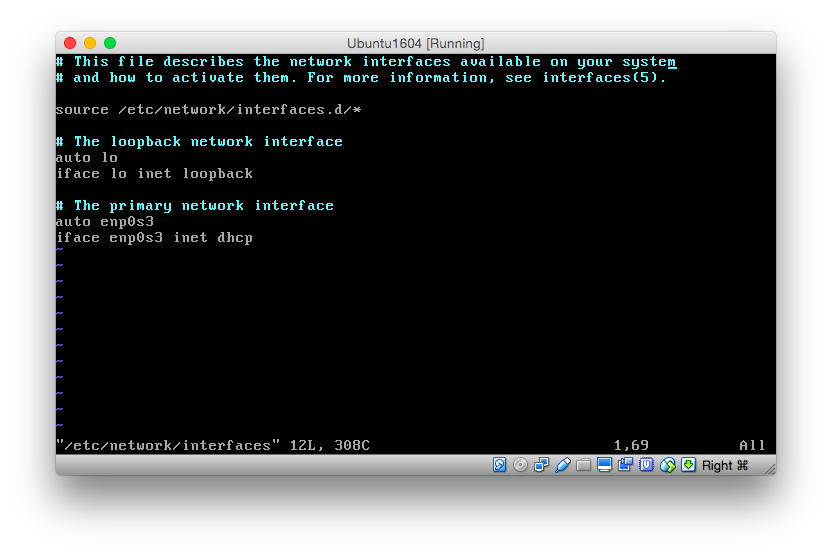
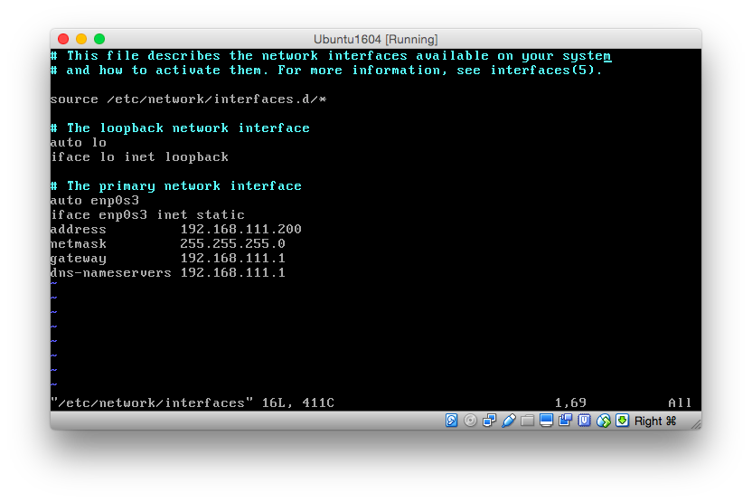
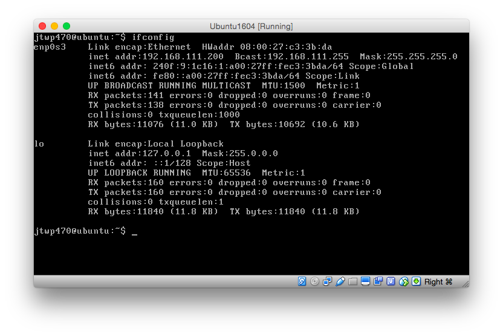

# 第2章: ネットワークの設定をし疎通を確認する
第1章ではUbuntuを仮想マシンにインストールしました.

この章ではネットワークの設定を行い, 仮想マシンにIPアドレスを付与します.

## IPアドレスを確認してみる
仮想マシンにログインした状態でIPアドレスを確認してみましょう.

`ifconfig`というコマンドや`ip a`などで実機のIPアドレスを確認することができます.



さてホストマシンでも同様のコマンドを入力してみます.

```
$ ifconfig
lo0:
 ~ ~ snip ~ ~
en0: flags=8863<UP,BROADCAST,SMART,RUNNING,SIMPLEX,MULTICAST> mtu 1500
        ether a4:d1:8c:e4:d4:88
        inet6 fe80::a6d1:8cff:fee4:d488%en0 prefixlen 64 scopeid 0x4
        inet 192.168.111.2 netmask 0xffffff00 broadcast 192.168.111.255
        inet6 240f:9:1c16:1:a6d1:8cff:fee4:d488 prefixlen 64 autoconf
        inet6 240f:9:1c16:1:d973:190:e450:f6f4 prefixlen 64 autoconf temporary
        inet6 240f:9:1c16:1::5 prefixlen 64 dynamic
        nd6 options=1<PERFORMNUD>
        media: autoselect
        status: active
~ snip ~
```
さて気づくと思いますが今, 3つのIPアドレスが出てきています.

| IPアドレス| マシン | 
|:-------------:|:---------------:|
| 10.0.2.15|仮想マシン|
| 127.0.0.1 | 仮想マシンとホストマシン|
| 192.168.111.2 | ホストマシン |

これらの関係はどうなっているのでしょうか?
まず仮想マシンからホストマシンに向け, `ping`というコマンドを実行してみます.
このコマンドはICMPというパケットを送り疎通確認を行うためのコマンドです.



するときちんと反応が返ってきます.
次にホストマシンから仮想マシンへpingをしてみます.

```
$ ping 10.0.2.15
PING 10.0.2.15 (10.0.2.15): 56 data bytes
36 bytes from ****************.ppp-bb.dion.ne.jp (121.106.***.***): Communication prohibited by filter
Vr HL TOS  Len   ID Flg  off TTL Pro  cks      Src      Dst
 4  5  00 5400 4be3   0 0000  3e  01 f50c 192.168.111.2  10.0.2.15

Request timeout for icmp_seq 0
Request timeout for icmp_seq 1
36 bytes from ****************.ppp-bb.dion.ne.jp (121.106.***.***): Communication prohibited by filter
Vr HL TOS  Len   ID Flg  off TTL Pro  cks      Src      Dst
 4  5  00 5400 94db   0 0000  3e  01 ac14 192.168.111.2  10.0.2.15
```

先ほどと違いつながっているようですがフィルターによって禁止されているようですね.

つまりこのネットワーク設定では仮想マシンからホストマシンへはアクセスできますがその逆, ホストマシンから仮想マシンへはアクセス出来ないということがわかります.

| Source | Desitination | Connection |
|:-----------:|:-----------:|:-----------:|
| ホストマシン | 仮想マシン | X |
| 仮想マシン | ホストマシン | O |

さて, なぜこのようになっているのでしょうか? 
これはNATという技術によって実現されています.
Wikipediaには[NAT](https://ja.wikipedia.org/wiki/%E3%83%8D%E3%83%83%E3%83%88%E3%83%AF%E3%83%BC%E3%82%AF%E3%82%A2%E3%83%89%E3%83%AC%E3%82%B9%E5%A4%89%E6%8F%9B)という記事が載っていますがこれは仮想マシンがホストマシンのNIC(ネットワークインターフェースカード, LANボードの事)に割り当てられたIPアドレスを裏で利用していることで仮想マシン側からホストマシンへアクセスできるとうわけです.

例えば, 自宅にはグローバルIPアドレスが1つしか付与されていないのにも関わらず何台もの計算機やスマートフォンがアクセスできるのもこの技術のおかげといえるでしょう.

さて, 今回はNATではホストマシンから参照することができません.そこでVirtualBoxの機能を用いて実際にIPアドレスを付与してみましょう.

## ブリッジ接続を実現してみよう
[Settings] -> [Network] -> [Adapter 1] を見てみましょう.以下のようにNATになっていることがわかります.



Attached to: というところでBridged Adapterを選択しNameの場所でブリッジするホストマシンのNICを選択します. 私の環境はMBAでLANに接続しているNICがen0(Wifi)のためそれを選択しOKを押します.

これが終了したら再度起動してみましょう.すると今度は先程とは異なるIPアドレスが割り当てられました.



私の環境では仮想マシンに `192.168.111.8` が割り当てられました.

それでは先ほど同様, 今度も`ping`にて双方向の疎通を確認してみます.

### 仮想マシンからホストマシン



きちんと疎通しています.

### ホストマシンから仮想マシン

```
$ ping 192.168.111.8

PING 192.168.111.8 (192.168.111.8): 56 data bytes
64 bytes from 192.168.111.8: icmp_seq=0 ttl=64 time=0.488 ms
64 bytes from 192.168.111.8: icmp_seq=1 ttl=64 time=0.746 ms
64 bytes from 192.168.111.8: icmp_seq=2 ttl=64 time=0.473 ms
64 bytes from 192.168.111.8: icmp_seq=3 ttl=64 time=0.771 ms
64 bytes from 192.168.111.8: icmp_seq=4 ttl=64 time=0.489 ms
64 bytes from 192.168.111.8: icmp_seq=5 ttl=64 time=0.366 ms
^C
--- 192.168.111.8 ping statistics ---
6 packets transmitted, 6 packets received, 0.0% packet loss
round-trip min/avg/max/stddev = 0.366/0.555/0.771/0.150 ms
```

きちんと疎通しています.

IPアドレスをまとめると以下のようになります.

| IPアドレス| マシン | 
|:-------------:|:---------------:|
| 192.168.111.8|仮想マシン|
| 192.168.111.2 | ホストマシン |

今回の例では `192.168.111.0/24` のIPアドレス内であれば通信できるので(理由: ブロードキャストアドレス(終端アドレス)が192.168.111.255だから)その範囲にあるクライアントと相互に通信することが可能です.

上記の手順で実際にLAN内に仮想マシンではありますがサーバーが置かれたこととなります.

## アドレスを固定化する
さて, 次にIPアドレスを固定化してみます.なぜ固定化するかというとそもそも仮想マシンに割り当てられた`192.168.111.8` というアドレスはDHCPという機能によってルーターが使っていないIPアドレスを適当に割り当てたためです. そのためもしかすると再起動したらIPアドレスが変わってしまうかもしれません.IPアドレスが変わってしまったら自分のサーバーのアドレスがわからなくなってしまいます.
そこでIPアドレスを固定することでどんなときでもそのIPアドレスでアクセスできるようになるというわけです.

さてUbuntuの場合, IPアドレスの設定を行うことで容易に変更することができます.やってみましょう.

**注意: 実際にLAN内でやる際は誰にも割り当てられていないIPアドレスを割り当てなければなりません**

今回は仮想マシンのIPアドレスを `192.168.111.200` に固定してみます.

まず 仮想マシンのBashを起動し  `$ sudo vi /etc/network/interfaces` を開きます.
開くと以下のようになっています.



次のように書き換えます.



設定する項目は以下のとおりです.

|設定項目|説明|
|:-----------|:---------|
| address | 固定するIPアドレス |
| netmask | ネットマスク |
| gateway | ルーターのアドレス |
| dns-nameservers | DNSサーバーのアドレス.大抵ルーターのアドレスと同じでよい |

仮想マシンを再起動します.

これでifconfigを使ってみるときちんと固定されていることがわかります.



最後にホストマシンの `/etc/hosts` に以下を追記してみましょう.

```
$ sudo vim /etc/hosts
192.168.111.200   jtwp470.local
```

`jtwp470.local`という名前でこのサーバーにアクセスすることができるようになりました.

実際にホストマシンから仮想マシンへ`ping`してみます.

```
 $ ping jtwp470.local
PING jtwp470.local (192.168.111.200): 56 data bytes
64 bytes from 192.168.111.200: icmp_seq=0 ttl=64 time=0.542 ms
64 bytes from 192.168.111.200: icmp_seq=1 ttl=64 time=0.349 ms
64 bytes from 192.168.111.200: icmp_seq=2 ttl=64 time=0.549 ms
64 bytes from 192.168.111.200: icmp_seq=3 ttl=64 time=0.320 ms
^C
--- jtwp470.local ping statistics ---
4 packets transmitted, 4 packets received, 0.0% packet loss
round-trip min/avg/max/stddev = 0.320/0.440/0.549/0.106 ms
```

### 課題

* 受講者のIPアドレスとドメイン名を適当に決めを自分の `/etc/hosts`に追加しpingを打ってみよう.
* ブロードキャストアドレスの範囲外にIPアドレスを設定するとどうなるか調べてみよう.
* VirtualBoxのネットワークアダプタのタイプはBridgeとNAT以外にもあった.それぞれ調べてみよう.

さて次の章ではSSHをインストールすることでホストマシンからSSHでアクセスできるようにします.また受講者各位がLAN内でアクセスできるため, 適当なセキュリティを設定していると楽しいことになることを勉強してみるとともに, インターネットに公開することを意識してセキュリティの設定をしてみましょう.


