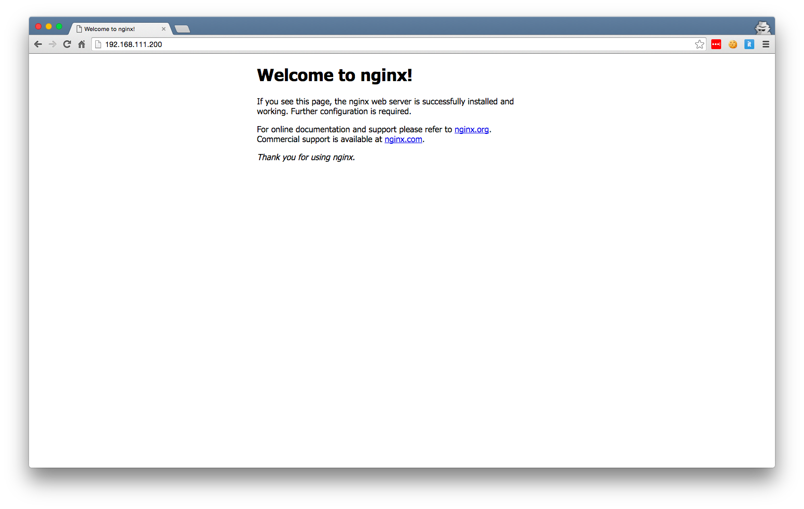
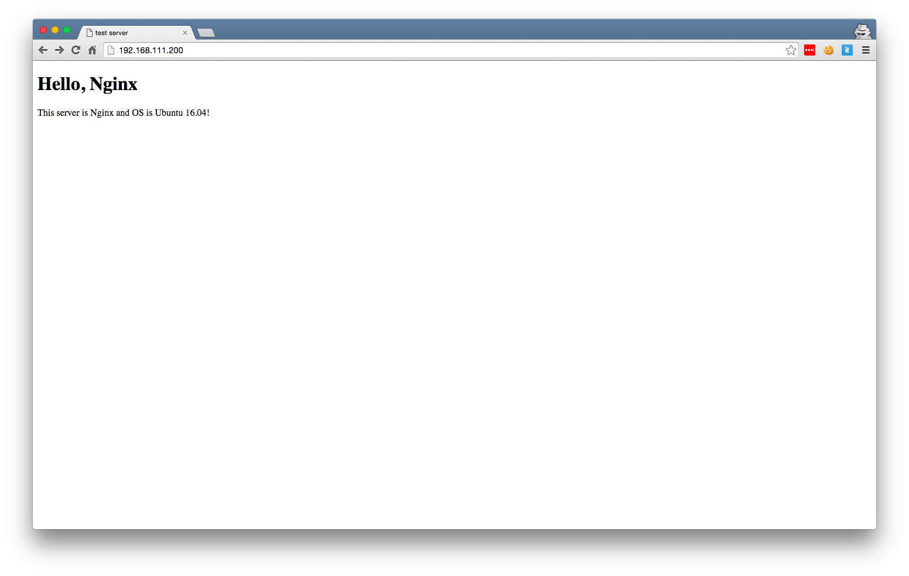

# 第4章: NginxをインストールしてWebサーバーを動かしてみる

この章では実際にWebサーバーをインストールしてHTMLを描画できるようにしてみます.

LinuxのWebサーバーソフトウェアは様々なものがありますが,大きなものではApacheとNginxと呼ばれるものが主流です.
Apacheのほうがまだまだ利用されているケースが多いようですが, メモリ使用量が比較的少なく, 動作も軽快であるNginxを今回は利用してみたいと思います.

## Nginxをインストールする
`sudo apt-get install nginx`でもすぐにNginxを入手することができるのですが開発が速いため少し古いものになってしまいます.今回は折角なのでできるだけ最新版を入れてみることにします.

仮想マシンにSSHして[Nginx公式ページのインストール法](https://www.nginx.com/resources/wiki/start/topics/tutorials/install/)に則ってインストールします.

```bash
$ sudo add-apt-repository ppa:nginx/stable
$ sudo apt-get update
$ sudo apt-get install nginx
```

これでNginxがインストールされました.

普通にホストマシンのWebブラウザで仮想マシンのURLを入力してみると`Welcome to nginx!`と書かれたページが表示されるはずです.



## 表示されるHTMLを書き換えてみる
表示されるだけでは面白くありませんね. 
そこで表示されるHTMLを書き換えてみましょう.

まずNginxの設定ファイルを開いてみます.

```
$ sudo vim /etc/nginx/site-available/default
server {
        listen 80 default_server;
        root /var/www/html;

        # Add index.php to the list if you are using PHP
        index index.html index.htm index.nginx-debian.html;
        server_name _;

        location / {
                # First attempt to serve request as file, then
                # as directory, then fall back to displaying a 404.
                try_files $uri $uri/ =404;
        }
```

↑のような感じで設定ファイルが出てきました.ここで書かれているものを1つずつ説明していきましょう.

* `listen 80` 80番ポートで待ち受けるという意味. ここを8080とかに置き換えると8080番で待ち受けるようになる.
* `root /var/www/html` このディレクトリのHTMLファイルを表示するという意味
* `index index.html index.htm ... `: サーバーにファイルを指定しないでアクセスした際に表示するファイル名
* `location /` NginxではURLのアクセスパターンによってどのようなファイルを表示するかなどを設定することができます.

基本的には上の設定をいじくり回すだけで簡単にHTMLファイルを表示してくれます.
今回は`/var/www/html`ではなく`${HOME}/www`を表示してみることにしましょう.

まず上記の設定ファイルの`root`を書き換えます. それを保存したあとに設定が正しいかどうかを判定してもらいます.

```bash
jtwp470@ubuntu:~$ sudo nginx -t
nginx: the configuration file /etc/nginx/nginx.conf syntax is ok
nginx: configuration file /etc/nginx/nginx.conf test is successful
```

設定が正しければ上のように表示されます.正しくなければどこが正しくないか教えてくれるのでそれを見て修正しましょう.

これが問題なければNginxをリロードします. Nginxの良い所は設定を変更してもサーバーを再起動させることなく(つまりWebサーバーが落ちない)設定を反映させることができるのです.
ではやってみましょう.

```bash
$ sudo service nginx reload
```

これで再度アクセスしてみましょう.
404 Not Found となりませんか? 

それもそのはずでホームディレクトリ下にディレクトリを作っていませんでしたw
それを踏まえてHTMLファイルを適当に書いてみます.

```bash
$ mkdir ~/www
$ vim ~/www/index.html
<!DOCTYPE html>
<head><title>test server</title></head>
<body>
<h1>Hello, Nginx</h1>
<p>This server is Nginx and OS is Ubuntu 16.04!</p>
</body>
</html>
```

これでブラウザに表示してみましょう.



これでHTMLファイルが変わりましたね.

## (オプショナル)SSLの設定をしてみる


