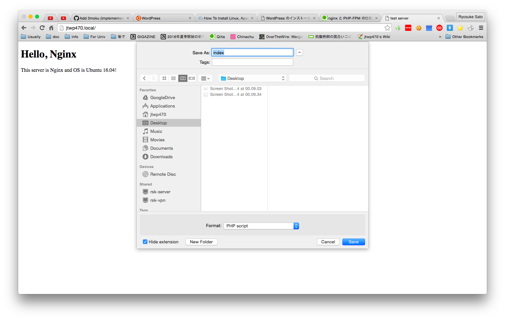
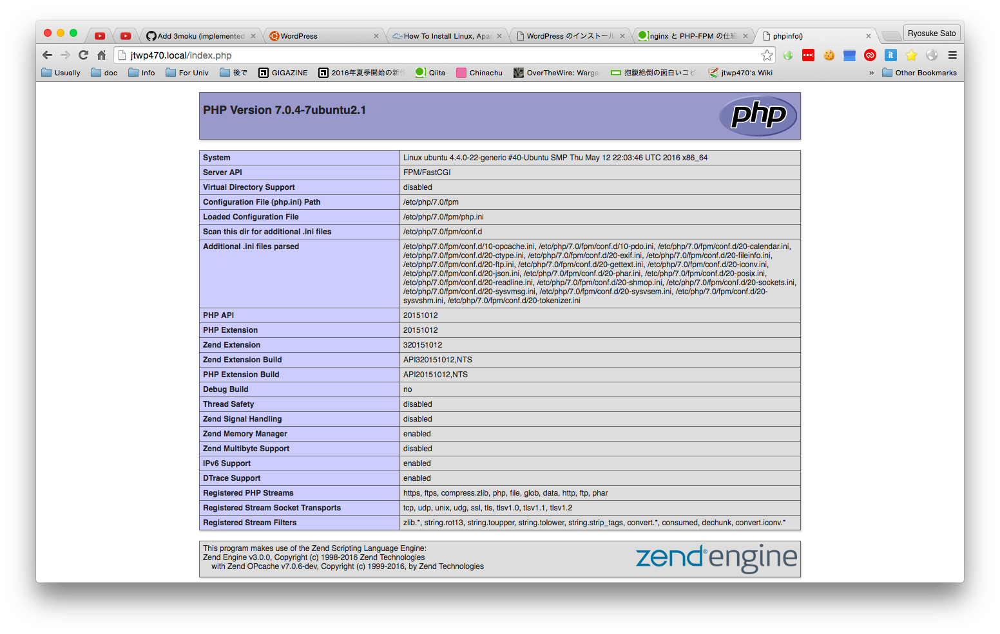
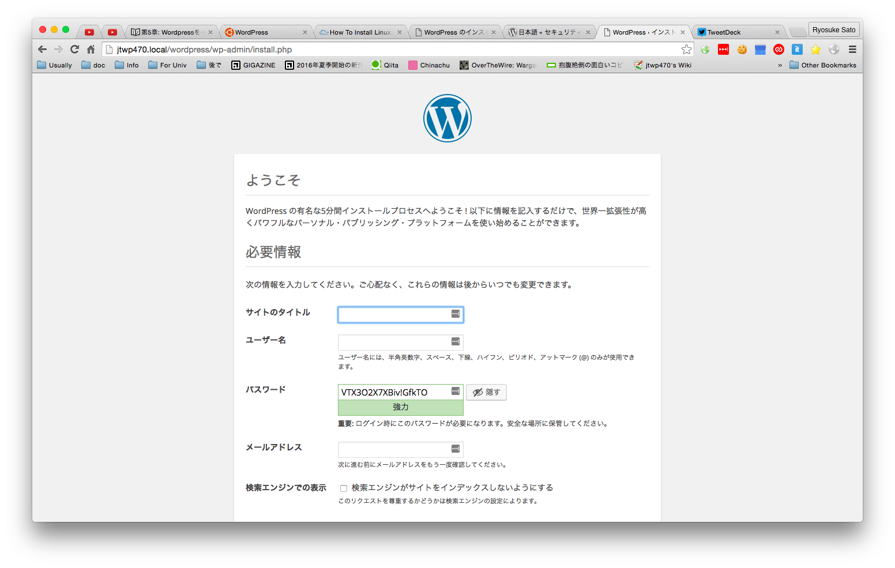
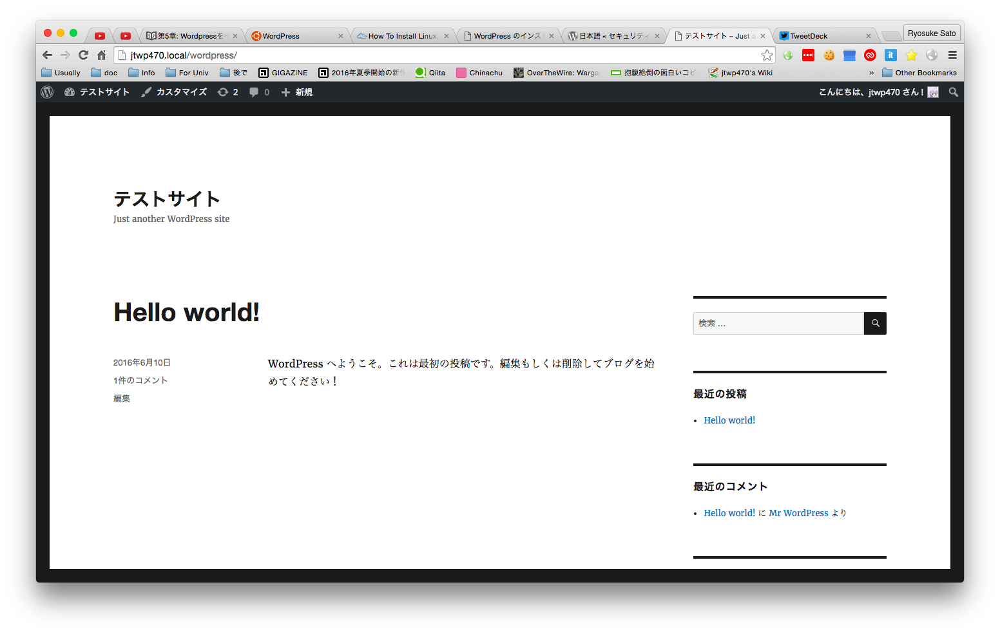

# 第5章: Wordpressをインストールして使えるようにする

前の章ではNginxをインストールしてWebサーバーを運用してみました.

この章ではそれだけでは面白く無いのでPHP製のブログエンジンであるWordpressを導入してみて動的なWebサイトを構築するにはどうすればいいかを学んでいきます.
なぜPHPでWordpressを選択したのか? というところですがPHPの面で言うと個人的に一番楽に動的なページを作れる言語だからといえます.なかなかHTMLと一緒にプログラミング言語を直接かけるというものはありませんし, RubyやPythonのようにLL言語の特性も活かせます.またWordpressはPHPで完成されたソフトウェアエンジニアでなくても扱えるCMSです.今回は特定のプログラミング言語を用いてWebアプリを作るというわけではないので採用に至りました.

ちなみにLinux, Apache, MySQL, PHPを合わせてLAMP環境と呼ぶことがあります.今回はApacheはNginxなのでこれに該当しませんが省略されて呼ばれるくらい有名な組み合わせであるということは覚えておきましょう.

## Wordpressを知る
ということでWordpressを知りましょう.
まず日本語公式サイトは[WordPress.org 日本語](https://ja.wordpress.org/)があります.

また利用例としては以下の様なサイトが有ります.

* [筑波大学公式ページ](http://www.tsukuba.ac.jp)
* [筑波大学アマチュア無線クラブ](http://jr1ztt.net)
* [さいたまスーパーアリーナの公式サイト](http://www.saitama-arena.co.jp/)

このように世界的にだけでなく日本国内でも多く利用されています.

## PHPをインストールしてNginxからPHPを実行できるようにする

Wordpressの概要を知れたところで最初にPHPが動作できるようにします.

例えば, 今の状態でPHPを実行してみるとどうなるかみてみましょう.

以下のコードを `${HOME}/www/index.php`に保存します.

```php
<?php phpinfo();
```

これでWebサーバーでアクセスしてみましょう.

僕の環境ではダウンロードするようになってしまいました.



これでは意味無いですね.では動作できるようにしてみましょう.

今のところPHP7.0がリリースされていますので最新版を利用してみます.

```bash
$ sudo apt install php7.0-fpm
~~ snip ~~
$ php7.0 --version
PHP 7.0.4-7ubuntu2.1 (cli) ( NTS )
Copyright (c) 1997-2016 The PHP Group
Zend Engine v3.0.0, Copyright (c) 1998-2016 Zend Technologies
    with Zend OPcache v7.0.6-dev, Copyright (c) 1999-2016, by Zend Technologies
```

ついでにコマンドラインで先ほどのindex.phpを実行してみます.

```bash
$ php ~/www/index.php
```

いろいろと出てくれば問題なしです.

次にNginxできちんとこれを動かせるようにします.

```bash
$ sudo vim /etc/nginx/sites-available/default
server {
        listen 80 default_server;

        index index.php index.html index.htm;
        server_name _;
        root /home/jtwp470/www;

        location / {
                if (-f $request_filename) {
                        expires 30d;
                        break;
                }
        }

        location ~ [^/]\.php(/|$) {
                fastcgi_split_path_info ^(.+\.php)(/.+)$;
                if (!-f $document_root$fastcgi_script_name) {
                        return 404;
                }
                fastcgi_pass unix:/var/run/php7.0-fpm.sock;
                fastcgi_index index.php;
                include fastcgi_params;

                fastcgi_param SCRIPT_FILENAME $document_root$fastcgi_script_name;
                fastcgi_param PATH_INFO $fastcgi_path_info;
                fastcgi_param PATH_TRANSLATED $document_root$fastcgi_path_info;
        }
}
```

最後に文法チェックをお忘れなく.


また一応`/etc/nginx/nginx.conf`を確認し実行ユーザーが`www-data`になっていることを見てください.

次にPHP-FPMの設定をします.

```bash
$ sudo vim  /etc/php/7.0/fpm/pool.d/www.conf
- listen = run/php/php7.0-fpm.sock
+ listen = /var/run/php7.0-fpm.sock
```

これで保存してPHP-FPMとNginxを再起動します.

```bash
$ sudo service nginx restart
$ sudo service php7.0-fpm restart
```

UNIXドメインソケットがうまくできているかを確認します.

```bash
$ netstat -a --unix | head
Active UNIX domain sockets (servers and established)
Proto RefCnt Flags       Type       State         I-Node   Path
unix  2      [ ]         DGRAM                    17244    /run/user/1000/systemd/notify
unix  2      [ ACC ]     STREAM     LISTENING     17245    /run/user/1000/systemd/private
unix  2      [ ACC ]     SEQPACKET  LISTENING     10292    /run/udev/control
unix  3      [ ]         DGRAM                    9883     /run/systemd/notify
unix  2      [ ACC ]     STREAM     LISTENING     12543    /run/snapd.socket
unix  2      [ ACC ]     STREAM     LISTENING     39664    /var/run/php7.0-fpm.sock
```

こんな感じで`/var/run/php7.0-fpm.sock`ができていればOK

では実際にブラウザでアクセスしてみましょう.
うまく行けば 以下の様な感じで表示されるはずです.



ちなみにうまくいかないと502エラーは返ってくるはずです.
こんなときは大抵どこか設定を間違えているはずなのでnginxのerror.logを見て解決しましょう.私もこれをやっている時に何度かミスってエラーになったのでこれを見て直しました.

```
jtwp470@ubuntu:~/www$ sudo tail -f /var/log/nginx/error.log
2016/06/10 00:36:47 [crit] 19130#19130: *6
 connect() to unix:/var/run/php7-fpm.sock failed (2: No such file or directory)
 while connecting to upstream, client: 192.168.111.2, server: _,
 request: "GET /index.php HTTP/1.1", upstream: "fastcgi://unix:/var/run/php7-fpm.sock:", host: "jtwp470.local"
```

なお, どうしてPHPを使うのにPHP-FPMを入れるの?等参考にしたサイトを上げておきますので興味があったら読んでみると良いでしょう.

* [Qiita - nginx と PHP-FPM の仕組みをちゃんと理解しながら PHP の実行環境を構築する](http://qiita.com/kotarella1110/items/634f6fafeb33ae0f51dc)

## MySQLをインストールする
次にMySQLをインストールします.

```bash
$ sudo apt install mysql-server
```

インストールの途中でrootユーザーのパスワードを設定する場所がありますので適切なパスワードを設定しておきます.

インストールが終わったらMySQLサーバーにログインします.

```bash
$ mysql -uroot -p
mysql -uroot -p
Enter password:
Welcome to the MySQL monitor.  Commands end with ; or \g.
Your MySQL connection id is 4
Server version: 5.7.12-0ubuntu1 (Ubuntu)

Copyright (c) 2000, 2016, Oracle and/or its affiliates. All rights reserved.

Oracle is a registered trademark of Oracle Corporation and/or its
affiliates. Other names may be trademarks of their respective
owners.

Type 'help;' or '\h' for help. Type '\c' to clear the current input statement.
mysql> CREATE DATABASE wordpress_db;
Query OK, 1 row affected (0.00 sec)

mysql> CREATE USER 'wordpress_user'@'localhost' IDENTIFIED BY 'wordpress_password';
Query OK, 0 rows affected (0.00 sec)

mysql> GRANT ALL PRIVILEGES ON wordpress_db.* TO 'wordpress_user'@'localhost';
Query OK, 0 rows affected (0.00 sec)

mysql> FLUSH PRIVILEGES;
Query OK, 0 rows affected (0.00 sec)
```

上記のコマンドの意味を以下に記します.

1. `wordpress-db`という名前のデータベースを作成
2. ユーザー`wordpress_user`, パスワード`wordpress_password`を作る.
3. 2で作ったユーザーに全権限を与える.
4. 設定を適用する

これでMySQLを利用できるようになりました.

## Wordpressをインストールする
では実際にWordPressをインストールしてみましょう.
今回はWordPressのファイルをそのまま公開領域にダウンロードして初期設定を行っていますが実際にやる場合は, 他の場所できちんと設定を行い, 正しい動作を確認してから移動してください.

```bash
$ curl -L https://ja.wordpress.org/wordpress-4.5.2-ja.tar.gz -o wordpress.tar.gz
~ snip ~
$ tar xvzof wordpress.tar.gz
$ ls
index.html index.php wordpress wordpress.tar.gz
```

では先程のデータベースの設定を`wp-config.php`に書いていきます.
ちなみにsampleが書いてあるのでそれをパクります.

```bash
$ cp ./wordpress/wp-config-sample.php ./wordpress/wp-config.php
$ vim ./wordpress/wp-config.php
```

以下の様な感じにすると良いでしょう.

```php
define('DB_NAME', 'wordpress_db');
define('DB_USER', 'wordpress_user');
define('DB_PASSWORD', 'wordpress_password');
```

また実際に本番環境に投入する場合は更に先にある認証用ユニークキーという部分をすべて設定する必要があります.今回はテスト導入のため設定をしませんが, きちんと行いましょう.

* [認証用ユニークキー](http://wpdocs.osdn.jp/wp-config.php_%E3%81%AE%E7%B7%A8%E9%9B%86#Security_Keys)

さてここまで来たらWebブラウザで開いてみます.
今回の例では`http://<your_url>/wordpress/`です.

すると, `お使いのサーバーの PHP では WordPress に必要な MySQL 拡張を利用できないようです。`というメッセージが現れます.
これはPHPとMySQLをコネクトするソフトウェアのインストール忘れによるものです.ですので追加で以下をインストールします.

```bash
$ sudo apt install php7.0-mysql
```

こうして再度アクセスすると `/wordpress/wp-admin/install.php`にリダイレクトされます.



あとはいい感じに設定をします.
うまく行けば次のステップでインストールが成功します.

トップページを表示してみます.



## (オプショナル) Rails製アプリをデプロイしてみる
